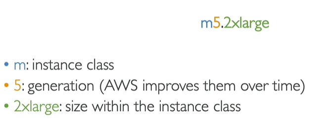

EC2 = Elastic Compute Cloud = Infrastructure as a Service

- Virtual machines EC2
- Storing virtual drives EBS
- Distributing load across machines ELB
- Scaling the service using an auto-scaling group ASG

config opt
- OS: Linux, windows and mac
- CPU
- RAM
- Storage EBS or EFS / EC2 instance store
- Networking
- Firewall
- Bootstrap script (configure at first launch): EC2 User Data

Boostrap Script: Launching script at the boot of machine, only run once when 1st start. Runs with the root user

Key pair to login in the EC2 required.

Types of EC2 Instances

- General Purpose: 
    webservers, balance.
- Compute Optimized: 
    CPU oriented: Batch processing workloads, Media, High perfo, Scientific, Machine learning, gaming
- Memory Optimized:
    High perfo. for DB
    Web scale cache store
    In-memory db for BI (business intelligence)
    app performing real-time / big structure date
- Accelerated Computing
    High frequency online transaction processing OLTP
    Relational NoSQL DB
    Cache Redis
    Data warehousing app
    Distributed file systems
- Storage Optimized
- Instance Features
- Measuring Instance Performance

for example m5.2xlarge
m: instance class
5: generation
2xlarge: size

Security Groups are "firewall" on EC2
    - Access ports
    - Authorised IP ranges
    - control inbound / outbound

    Security group cannot access is a security group issue
    you can use SG inside SG like:
        SG: inbound: SG1 + SG2.

    Ports to know:
        - 22 SSH: secure shell
        - 21 FTP: File Trx Protocol
        - 22 SFTP: SecureFTP
        - 80 HTTP unsecure
        - 443 HTTPS secure
        - 3389 RDP: Remote desktop protocol - windows
        
