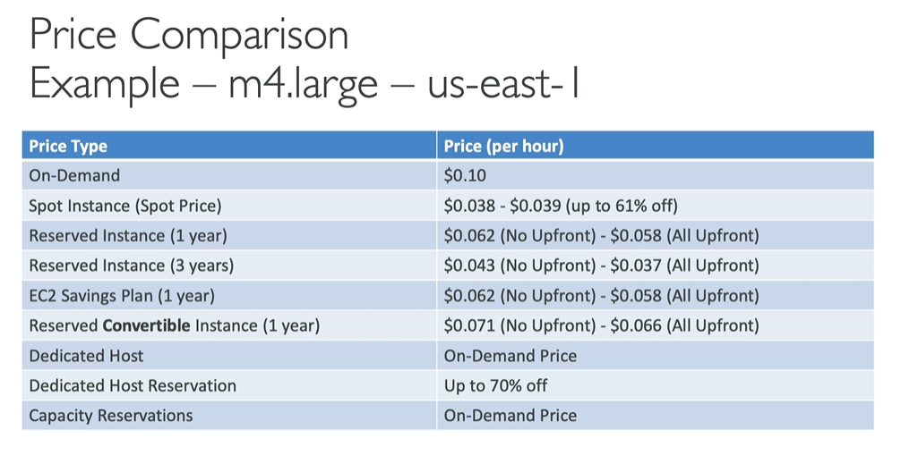

EC2 Reserver Instances - pricing

- Up to 72% discount compared to On-demand
- You reserve a specific type of instance attributes
- Reservation period: 1 year (+discount) / 3 years (+++discount)
- Payment option discounts: No Upfront(+), Partial Upfront(++), All Upfront(+++)
- this for example for DB
- You can buy and sell in the Reserver Instance Marketplace

Convertible Reserved Instance
 - Can change the EC2 instance type, instance family, OS, scope and tenancy
 - Up to 66% discount

EC2 saving plans
- Get a discount based on long-term usage (up to 72% - same as RIs)
- Commit to certain type of usage ($10/hour for 1 or 3 years)
- Usage beyond EC2 Saving Plans is billed at the On-Demand price

- Locked at specific instance family & AWS region
- Flexible across: 
    - Instance size, OS, Tenancy

EC2 spot instances
- up to 90% discount
- you can lose it
- The most cost-efficent

- Useful for:
    - Batch jobs
    - Data analysis
    - Image processing
    - Any distribute workloads
    - Workloads with a flexible start and end time

